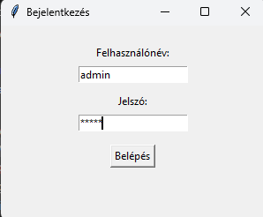
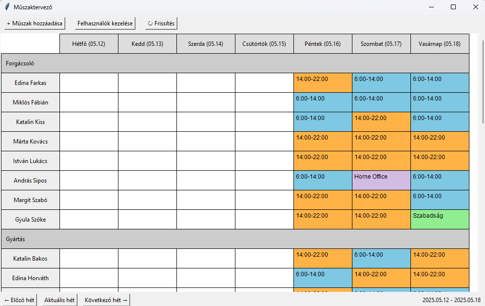

# Műszaktervező alkalmazás

Ez egy egyszerű, Python alapú asztali alkalmazás, amely segít a dolgozói műszakbeosztások kezelésében. A program belépés után lehetőséget biztosít műszakok hozzáadására, módosítására, valamint felhasználók kezelésére is.

## Főbb funkciók

- Felhasználónév / jelszavas belépés
- Heti műszaknézet osztályozva részlegek szerint
- Új műszakok hozzáadása, meglévők szerkesztése
- Felhasználók adatainak kezelése
- SQLite adatbázis használat
- GUI felület: Tkinter segítségével

## Használat

1. **Adatbázis létrehozása** (ha még nincs `muszaktervezo.db` fájl):
    ```bash
    python database/create_db.py
    python seed/seed_data.py
    ```

2. **Program futtatása**:
    ```bash
    python main.py
    ```

3. **Alap felhasználó**:
    - Felhasználónév: `admin`
    - Jelszó: `admin`

## Könyvtárstruktúra

- `main.py`: alkalmazás belépési pont
- `models/`: SQLAlchemy modellek
- `database/`: adatbázis kapcsolat és létrehozás
- `gui/`: Tkinter felület + nézetek
- `services/`: üzleti logika
- `seed/`: tesztadatok betöltése
- `config.py`: konfigurációs beállítások

## Függőségek

Lásd: `requirements.txt`

## Képernyőképek

### Belépés


### Heti műszakbeosztás


## Megjegyzés

Ez a projekt egy Python alapszintű kurzus zárófeladata, amely a gyakorlás és a tudás elmélyítése céljából készült. Bár nem minden funkció tökéletes, a cél az volt, hogy egy működő MVP szintű alkalmazás szülessen.

---

